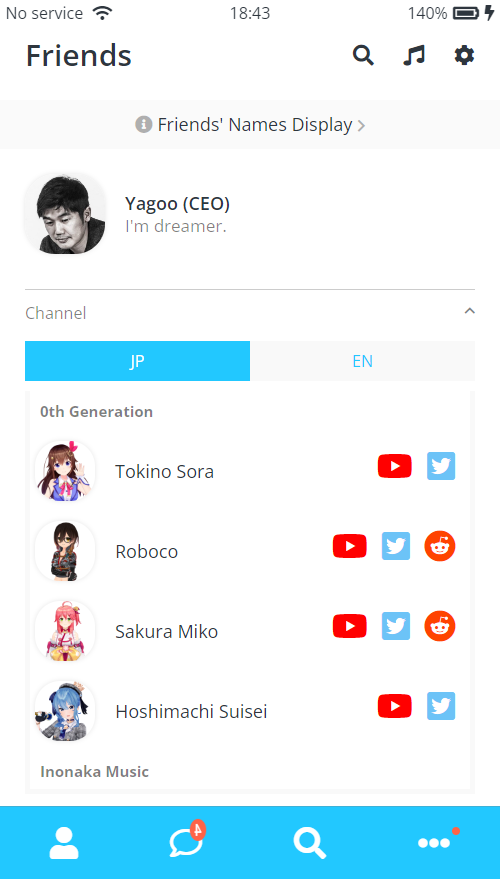
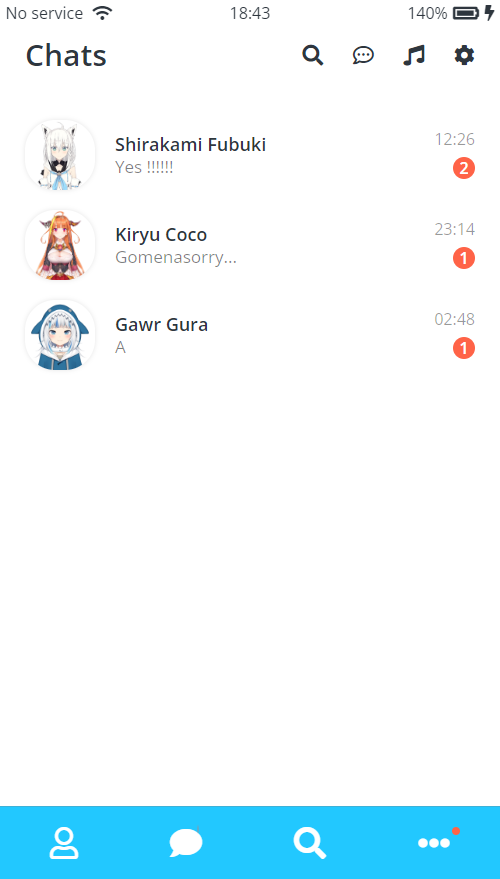
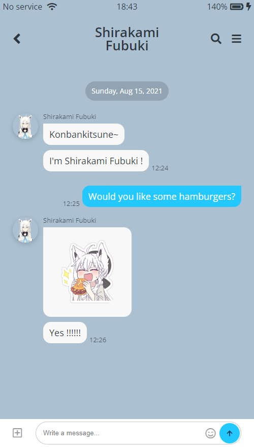

# HoloLine (kakaotalk clone page)

`HTML5` + `CSS3`로 만든 카카오톡 클론 페이지

## Introduce

> **HoloLine**은 [Hololive 프로덕션](https://en.hololive.tv/)의 버츄얼 유튜버들을 소개하는 `kakaotalk`을 클론한 페이지로 순수 `HTML5`와 `CSS3`으로만 작성되었습니다. `sementic tag`를 적극적으로 활용할려고 하면서 `css class` 네이밍을 사용용도에 맞게 `BEM`방식으로 작성하였습니다. 또한 `CSS Animation`이 채팅창에서 구현되었습니다.

[HoloLine](https://huketo.github.io/kokoa-clone-2021/) 바로가기

## Images

## Nomad Coder Challenges

[노마드코더](https://nomadcoders.co/kokoa-clone) `HTML` + `CSS` 강의를 들으면서 다른 수강생들과 같이 매주 주어지는 과제와 최종 결과물을 만들어내는 챌린지를 통해서 집중도 있는 공부를 했습니다. 다른 수강생들과 `Slack`을 통해서 서로 모르는 것에 대해서 공유하면서 알찬 공부를 할 수 있어서 좋았습니다.

🎉 노마드코더 코코아챌린지 20기 우수작 당선 (naruto1458) 🎉 [바로가기](https://nomadcoders.co/community/thread/1051)
