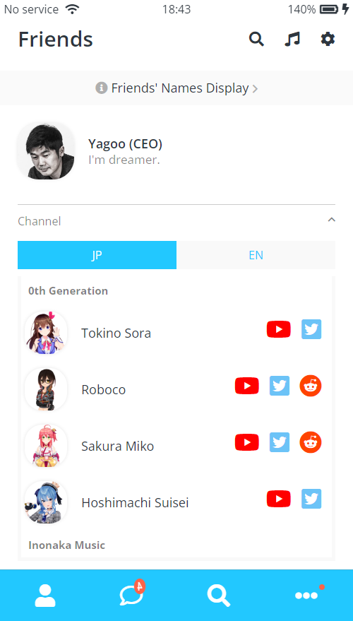
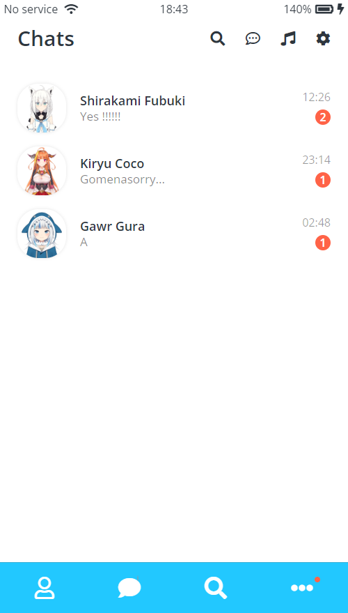
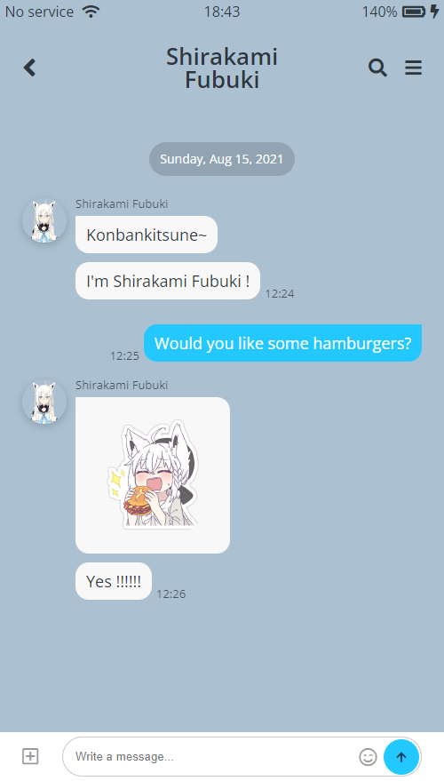

# HoloLine

HoloLine: A Hololive Fan Site Designed in Messenger Style

Use only `html` + `css`, no javascript

## Images

    
    
    

## Nomad Coder Challenges

[노마드코더](https://nomadcoders.co/kokoa-clone) `HTML` + `CSS` 강의를 들으면서 다른 수강생들과 같이 매주 주어지는 과제와 최종 결과물을 만들어내는 챌린지를 통해서 집중도 있는 공부를 했습니다. 다른 수강생들과 `Slack`을 통해서 서로 모르는 것에 대해서 공유하면서 알찬 공부를 할 수 있어서 좋았습니다.

🎉 노마드코더 코코아챌린지 20기 우수작 당선 (naruto1458) 🎉 [바로가기](https://nomadcoders.co/community/thread/1051)
